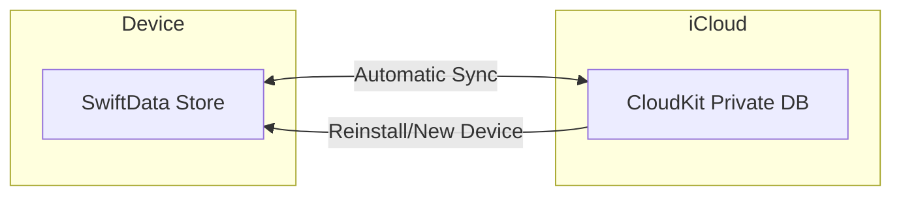

# iCloud Sync for SwiftData

## Architecture



## Implementation Steps

### 1. Enable iCloud Capability

In Xcode (or via Tuist entitlements):
- Add "iCloud" capability to the app target
- Enable "CloudKit" service
- Create/select a CloudKit container (e.g., `iCloud.dev.tuist.benjamin`)

For Tuist, update [`Project.swift`](benjamin/Project.swift) to add entitlements with the iCloud container.

### 2. Configure SwiftData for CloudKit

Update [`BenjaminApp.swift`](benjamin/benjamin/Sources/App/BenjaminApp.swift) to use a CloudKit-enabled model container:

```swift
var body: some Scene {
    WindowGroup {
        ContentView()
            .environmentObject(appState)
    }
    .modelContainer(for: [Account.self, BalanceSnapshot.self], 
                    inMemory: false,
                    isAutosaveEnabled: true,
                    isUndoEnabled: false,
                    onSetup: { _ in })
}
```

The default SwiftData configuration automatically syncs with CloudKit when the iCloud capability is enabled and you use the private database.

### 3. Update Models for CloudKit Compatibility

CloudKit requires all properties to be optional or have default values. Your current models need minor adjustments:

**[`Account.swift`](benjamin/benjamin/Sources/Models/Account.swift)**:
- `lastUpdatedAt` is already optional (good)
- All other properties have defaults in `init` (good)
- Add explicit default values as property declarations for CloudKit

**[`BalanceSnapshot.swift`](benjamin/benjamin/Sources/Models/BalanceSnapshot.swift)**:
- Properties need default values or be optional for CloudKit compatibility

### 4. Schema Versioning Strategy

Create a versioned schema to handle future migrations safely:

```swift
// SchemaVersions.swift
enum SchemaV1: VersionedSchema {
    static var versionIdentifier = Schema.Version(1, 0, 0)
    static var models: [any PersistentModel.Type] {
        [Account.self, BalanceSnapshot.self]
    }
}

enum BenjaminMigrationPlan: SchemaMigrationPlan {
    static var schemas: [any VersionedSchema.Type] {
        [SchemaV1.self]
    }
    static var stages: [MigrationStage] { [] }
}
```

---

## Schema Change Rules (Critical)

When you need to modify models in the future:

| Safe Changes | Unsafe Changes (Require Migration) |
|--------------|-----------------------------------|
| Add optional property with default | Delete any property |
| Add new model type | Rename property |
| Add new relationship | Change property type |

**For unsafe changes**: 
1. Add new property with the desired name/type
2. Write migration code to copy data
3. Mark old property as deprecated (keep it, don't delete)
4. Increment schema version

---

## Files to Create/Modify

| File | Action |
|------|--------|
| `Project.swift` | Add iCloud entitlements |
| `benjamin.entitlements` (new) | Define iCloud container |
| `BenjaminApp.swift` | Configure CloudKit-aware container |
| `Account.swift` | Add default values to properties |
| `BalanceSnapshot.swift` | Make properties optional or add defaults |
| `SchemaVersions.swift` (new) | Versioned schema for migrations |

---

## Testing Considerations

- CloudKit sync only works on real devices (not simulator for private DB)
- Use CloudKit Console to inspect/reset data during development
- Test reinstall flow by deleting app and reinstalling
